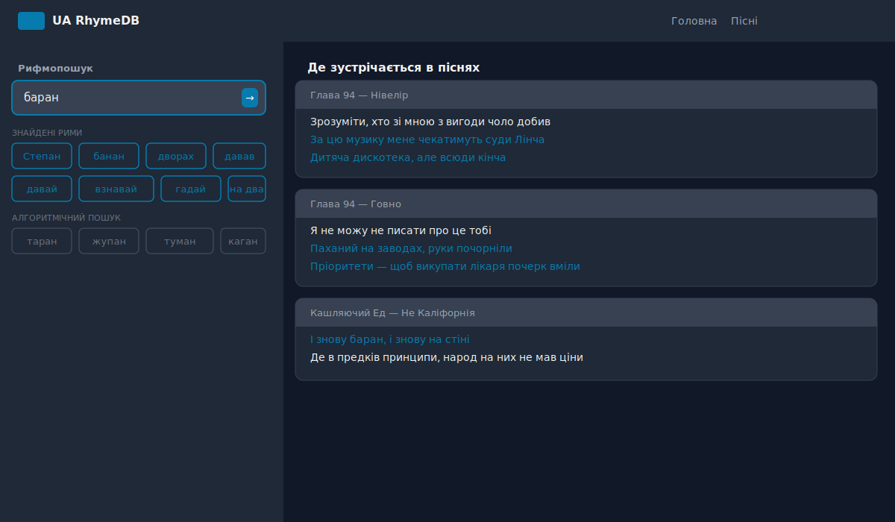
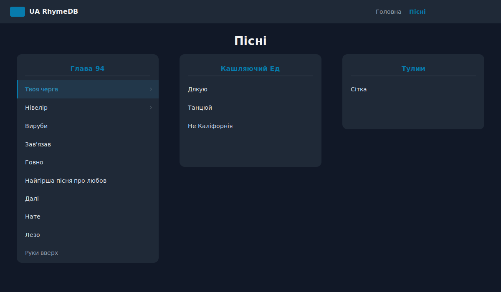
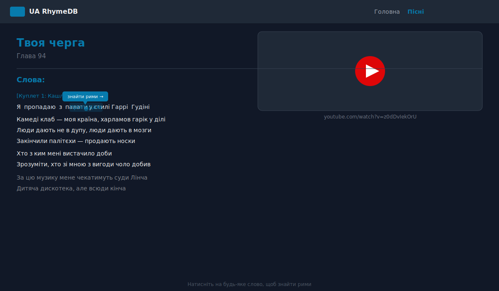

# UA RhymeDB

База даних римувань українських виконавців. Збирає слова та фрази, які римуються між собою, та зв'язує їх з конкретними рядками в піснях.

> **Цей проєкт орієнтований на локальний запуск і особисте користування.** Деплой на GitHub Pages існує більше як демонстраційний — основна цінність у тому, щоб клонувати репозиторій, запустити локально і додавати власні пісні та рими у текстових файлах.

## Зміст

- [Що це таке](#що-це-таке)
- [Швидкий старт](#швидкий-старт)
- [Структура проєкту](#структура-проєкту)
- [Формати даних](#формати-даних)
  - [Файл пісні](#файл-пісні)
  - [Файл рими](#файл-рими)
  - [Індекс пісень](#індекс-пісень)
- [Як додати нову пісню](#як-додати-нову-пісню)
- [Як додати/оновити риму](#як-додатионовити-риму)
- [Архітектура](#архітектура)
- [Алгоритми пошуку](#алгоритми-пошуку)

## Що це таке


UA RhymeDB — це SPA на React, який дозволяє:

- Шукати рими до українського слова чи фрази.
- Переглядати, в яких саме рядках пісень ці рими зустрічаються.
- Гортати тексти пісень з клікабельними словами (тап по слову → пошук рим).
- Дивитися список пісень, згрупований за виконавцем.

Дані зберігаються **у вигляді текстових файлів у репозиторії** — без бази даних, без бекенду. Це свідомий вибір: курування контенту відбувається через `git`, а не через адмінку.

| Пошук рим | Список пісень |
|---|---|
|  |  |



## Швидкий старт

```bash
# 1. Клонуй
git clone https://github.com/yurkagon/ua-rhyme-db.git
cd ua-rhyme-db

# 2. Встанови залежності
npm install

# 3. Запусти dev-сервер (http://localhost:3000)
npm run dev
```

Інші команди:

| Команда | Що робить |
|---|---|
| `npm run dev` | Webpack dev-server з hot reload |
| `npm run build` | Продакшн-збірка в `build/` |
| `npm run serve` | Підняти готовий білд на `http://localhost:3001` |
| `npm run deploy` | Деплой на GitHub Pages (через `gh-pages`) |

## Структура проєкту

```
.
├── database/
│   ├── bundled/              ← інлайниться у JS-бандл
│   │   ├── rhymes/           ← файли з римами (один файл = одна група)
│   │   └── song_list         ← згенерований індекс пісень (не редагувати руками)
│   └── lazy/
│       └── songs/            ← тексти пісень (вантажаться по запиту)
├── setup/
│   ├── webpack.common.js     ← спільна webpack-конфігурація
│   ├── webpack.dev.js        ← dev (port 3000, hot reload)
│   ├── webpack.prod.js       ← prod (contenthash, publicPath від homepage)
│   └── generate_song_list.js ← build-step: генерує song_list з папки songs/
├── src/
│   ├── App.ts                ← Application.findRhymes() — точка входу пошуку
│   ├── lib/
│   │   └── rhymer.ts         ← фонетичний алгоритмічний пошук
│   ├── services/
│   │   └── StaticDatabase/   ← завантаження і кешування даних
│   ├── pages/                ← Root, Songs, Song, Search, NotFound
│   ├── components/           ← Layout, Header, Footer, SearchForm
│   ├── bootstrap/            ← роутер
│   └── utils.ts              ← formatWord, splitByWords тощо
└── public/
    └── index.html
```

## Формати даних

### Файл пісні

Лежить у `database/lazy/songs/`. **Ім'я файлу** — це і є метадані:

```
<songId>_<authorId>_<authorName>_<songName>
```

Приклад: `glava941_glava94_Глава 94_Твоя черга`

> ⚠️ Чотири поля через `_`. Якщо в назві пісні чи виконавця є `_`, парсер зламається.

**Вміст файлу** — текст пісні + блок метаданих, розділені рядком `###`:

```
[Куплет 1: Кашляючий Ед]
Я пропадаю з палати у стилі Гаррі Гудіні
Камеді клаб — моя країна, харламов гарік у ділі
...

[Приспів]
Скажи мені, де твоя половина
...

###
id:glava941
author_id:glava94
author:Глава 94
name:Твоя черга
youtube:https://www.youtube.com/watch?v=z0dDvIekOrU
```

Правила тексту:
- Блоки в `[...]` (наприклад `[Куплет 1]`, `[Приспів]`) — рендеряться курсивом і не клікабельні.
- Кожен інший рядок — це рядок лірики, слова в ньому стають клікабельними.
- **Нумерація рядків — 1-based**, рахується від першого рядка тексту (до `###`). Це важливо для посилань з файлів рим.

Метадані після `###`:
- `id` — має співпадати з першим полем імені файлу.
- `author_id`, `author`, `name` — аналогічно решті полів імені.
- `youtube` (опціонально) — повне посилання на ютуб; UI перетворює `watch?v=` на `embed/`.

### Файл рими

Лежить у `database/bundled/rhymes/`. **Ім'я файлу** — це слово-якір групи (наприклад `баран`, `Каліфорнія`).

**Вміст** — список слів/фраз, що римуються між собою, по одній на рядок:

```
баран#r:glava942[20-21]
Степан#r:glava946[38-39]
дворах#r:glava942[20-21]
банан
давав
давай
взнавай/взнавав
вставай/вставав
гадай
вгадай/вгадав
```

Синтаксис рядка:

```
<слово>[/альтернатива1/альтернатива2]#<тип>:<інфо>
```

- **`/`** — альтернативні форми того ж слова (`взнавай/взнавав` означає, що це варіанти однієї одиниці). При пошуку всі варіанти знаходять групу.
- **`#`** — додаткова метаінформація, опціонально.
- **`#r:<songId>[<from>-<to>]`** — посилання на діапазон рядків у пісні, де ця рима звучить. Кілька входжень через кому:
  ```
  баран#r:glava942[20-21],glava946[38-39]
  ```
  Якщо рима в одному рядку, можна писати `[20]` замість `[20-20]`.

Файли рим, які не мають `#r:` посилань, — це просто "довідкова частина" групи: алгоритмічний пошук їх знайде, але посилань на пісні не покаже.

### Індекс пісень

`database/bundled/song_list` — **генерується автоматично**. Build-step [`setup/generate_song_list.js`](setup/generate_song_list.js) запускається при кожному `npm run dev`/`build` і перезаписує цей файл, читаючи папку `database/lazy/songs/`. Не редагуй його руками.

## Як додати нову пісню

1. Створи файл у `database/lazy/songs/` з ім'ям `<id>_<authorId>_<author>_<name>`.
2. Встав текст пісні, потім `###`, потім метаблок (приклад вище).
3. Перезапусти `npm run dev` — індекс пісень перегенерується автоматично.
4. (Опціонально) Пройдися по файлах у `database/bundled/rhymes/` і додай `#r:<твій_songId>[<from>-<to>]` до тих груп, у яких є рими з цієї пісні. Або створи нові файли рим для нових груп.

## Як додати/оновити риму

**Новий римограй (нова група):**
1. Створи файл у `database/bundled/rhymes/` з ім'ям-якорем (наприклад `вибір`).
2. Перший рядок — слово-якір з посиланням на пісню: `вибір#r:glava947[14-15]`.
3. Далі — інші слова/фрази, що римуються (з або без `#r:` посилань).

**Доповнити існуючу групу:**
- Додай новий рядок у потрібний файл, або
- Додай ще одне посилання в існуючому рядку через кому: `баран#r:glava942[20-21],glava947[5]`.

## Архітектура

Якщо коротко — це **статичний сайт без бекенду**, де:

- **Метадані рим** (структура груп, які слова з якими римуються, посилання на рядки пісень) вшиваються в JS-бандл під час білда через webpack `asset/source` + `require.context`.
- **Тексти пісень** лежать поруч як окремі ассети (`asset/resource`) і вантажаться через `fetch` тільки коли користувач відкрив пісню чи перейшов на сторінку пошуку (для прев'ю-карток з рядками).
- **Пошук рим** працює повністю на клієнті, без жодних мережевих запитів (після того як завантажився основний бандл).

Точка входу для пошуку — [`src/App.ts`](src/App.ts):

```
phrase
  ├─→ Application.find()      ← пошук у курованій базі (по групах рим)
  │     ├─ exact-match по value або alternatives
  │     └─ multi-word рекурсія (викидає перше слово і шукає знов)
  │
  └─→ Rhymer.findRhymes()     ← фонетичний алгоритм-fallback
        ├─ findByEnd (за останніми 2 символами)
        └─ findByStart (за першими 2 символами)
```

Дані завантажуються один раз при старті в синглтон [`StaticDatabase`](src/services/StaticDatabase/StaticDatabase.ts):

- `rhymeData: RhymeBlock[]` — масив груп рим (як у файлах).
- `rhymeWords: Rhyme[]` — плоский dedup'd список усіх слів (для алгоритмічного пошуку).
- `songList: Song[]` — список пісень з URL'ами на lazy-ассети.

[`RawFileExtractor`](src/services/StaticDatabase/RawFileExtractor.ts) інкапсулює webpack-специфічні `require.context` / `require` виклики, щоб основна логіка `StaticDatabase` лишалась чистою.

## Алгоритми пошуку

**Кураторський пошук** ([`App.ts`](src/App.ts)):
- Користувач вводить слово/фразу → `formatWord()` приводить до нормалізованої форми (lowercase, без апострофів, лапок, дефіси замінюються на пробіли).
- Сканує всі `rhymeData` і знаходить групи, де серед `value` чи `alternatives` є введене слово.
- Повертає всі рими з цих груп + усі `mentions` для прев'ю-карток.
- Якщо фраза multi-word — рекурсивно повторює пошук, скидаючи перше слово ("чорний прапор" → "прапор").

**Фонетичний пошук** ([`lib/rhymer.ts`](src/lib/rhymer.ts)):
- Літери класифікуються на 4 групи з пріоритетом:
  ```
  vowels (4) > consonantsSonorousOnly (3) > consonantsSonorous (2) > consonantsMuffled (1)
  ```
- Будується regex по N останніх символах (`findByEnd`) або перших (`findByStart`).
- Прогонить regex по `rhymeWords` → знайдені слова відмічаються як `algorithmic: true` (в UI рендеряться іншим стилем).

Результат `findRhymes()` об'єднується з пріоритетом курованих над алгоритмічними (через `_.uniqBy("label")`).

## Ліцензія

[ISC](LICENSE) © 2023 Yurii Khvishchuk
